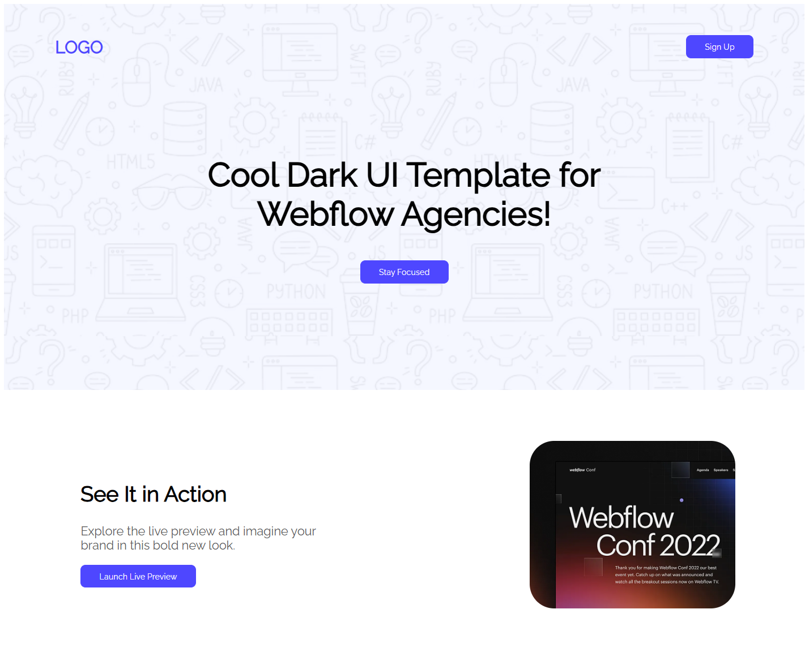

# Fully-Complete-Compleat-Assinment-01-B12
# ছোট HTML & CSS প্রজেক্ট

এই প্রজেক্টটি একটি সাধারণ ওয়েবপেজ যা শুধুমাত্র HTML এবং CSS ব্যবহার করে তৈরি করা হয়েছে। এটি শিক্ষাগত উদ্দেশ্যে বানানো হয়েছে এবং বেসিক ফ্রন্ট-এন্ড ডিজাইন শিখার জন্য সহায়ক।

## 🔥 ফিচারসমূহ

- 📄 সম্পূর্ণ HTML5 মার্কআপ
- 🎨 কাস্টম CSS ডিজাইন
- 🚀 লাইটওয়েট এবং দ্রুত লোড হয়

## 🛠️ টেকনোলজি

- HTML5
- CSS3

## 🌐 লাইভ লিংক

🔗 [প্রজেক্টটি লাইভ দেখুন](https://mdrifadulhaquelimon.github.io/Fully-Complete-Compleat-Assinment-01-B12/)



## ⚙️ কিভাবে রান করতে হবে

1. এই রিপোজিটরি ক্লোন করো:

```bash
git clone https://github.com/MdRifadulHaqueLimon/Fully-Complete-Compleat-Assinment-01-B12.git
